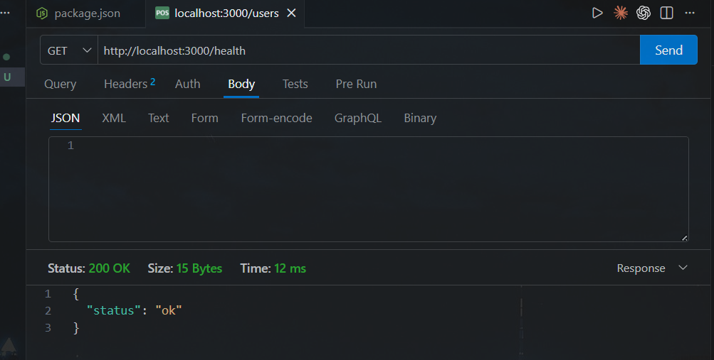
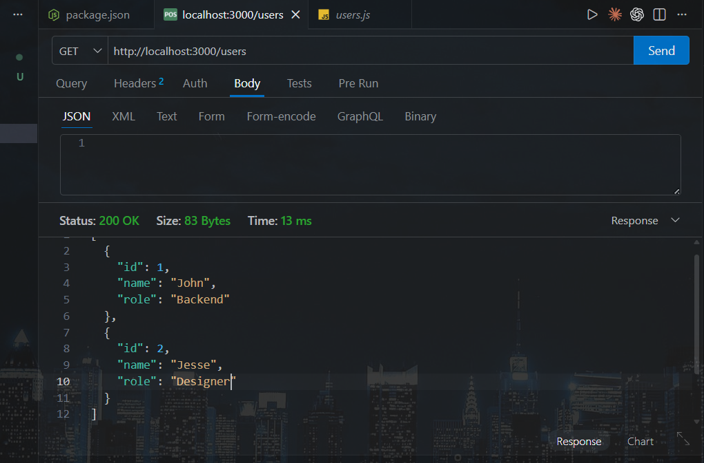
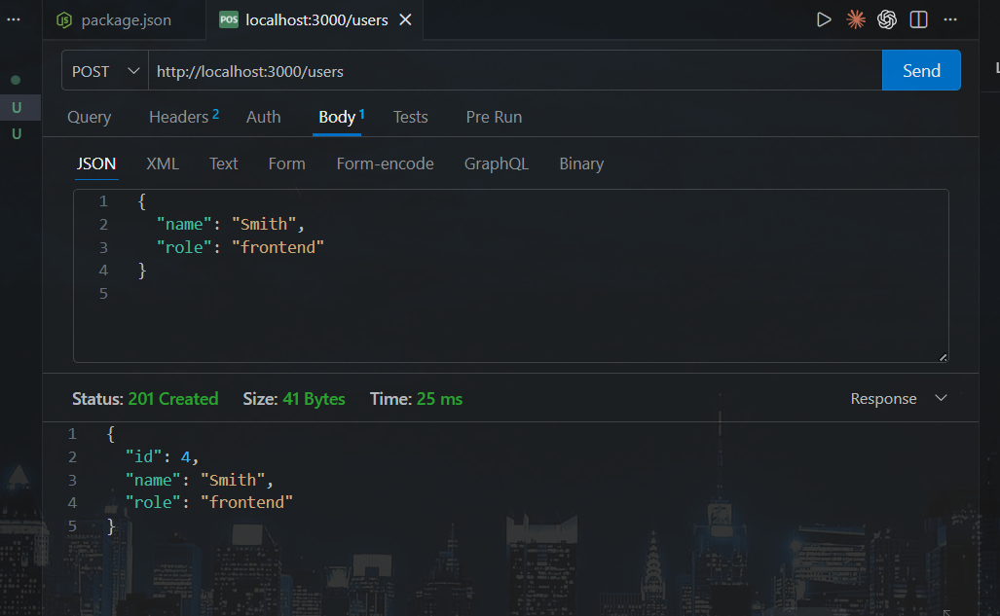
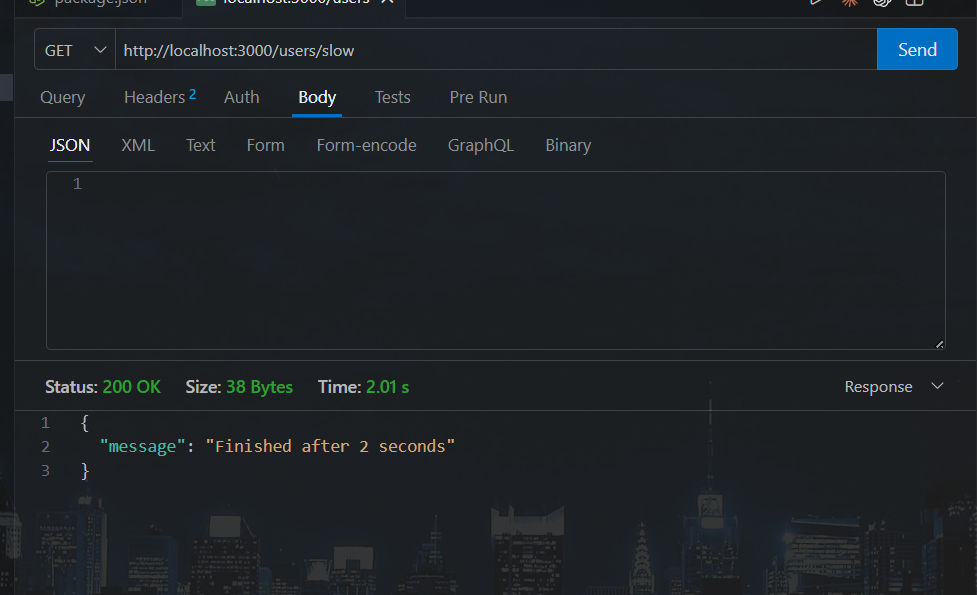

# Small API

A small REST API built with Node.js and Express for managing users.

## Endpoints

| Method | URL | Description |
|--------|-----|-------------|
| `GET` | `/health` | Returns server status |
| `GET` | `/users` | Returns all users |
| `POST` | `/users` | Creates a new user (requires `name` and `role`) |
| `GET` | `/users/slow` | Async endpoint that waits 2 seconds before responding |

## Examples

### GET /health
Returns `{ "status": "ok" }`.

### GET /users
Returns the list of all users.

### POST /users
Creates a new user with `name` and `role`. Returns the created user with a generated `id`.

### GET /users/slow
Waits 2 seconds, then returns `{ "message": "Finished after 2 seconds" }`.

