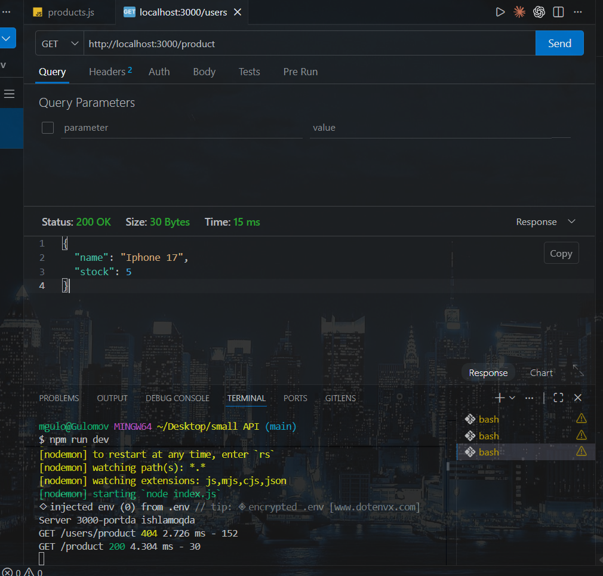
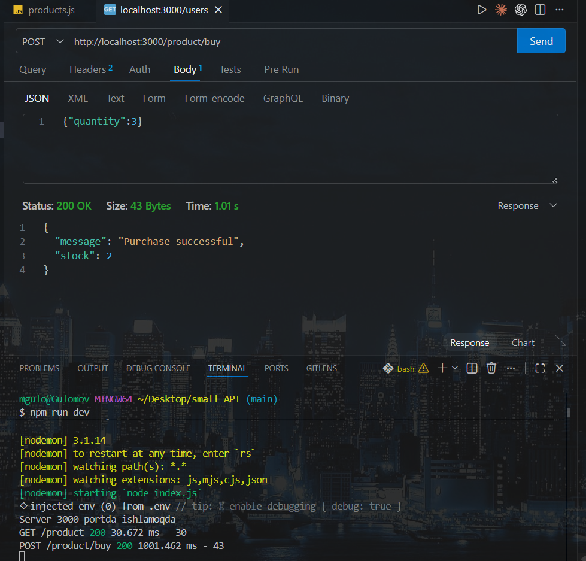
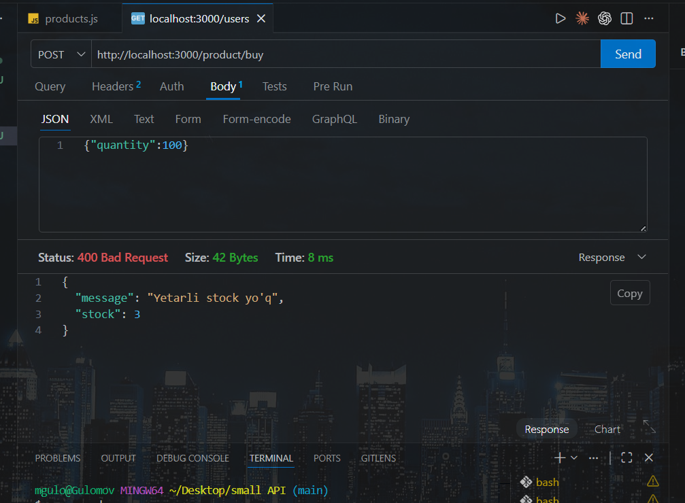
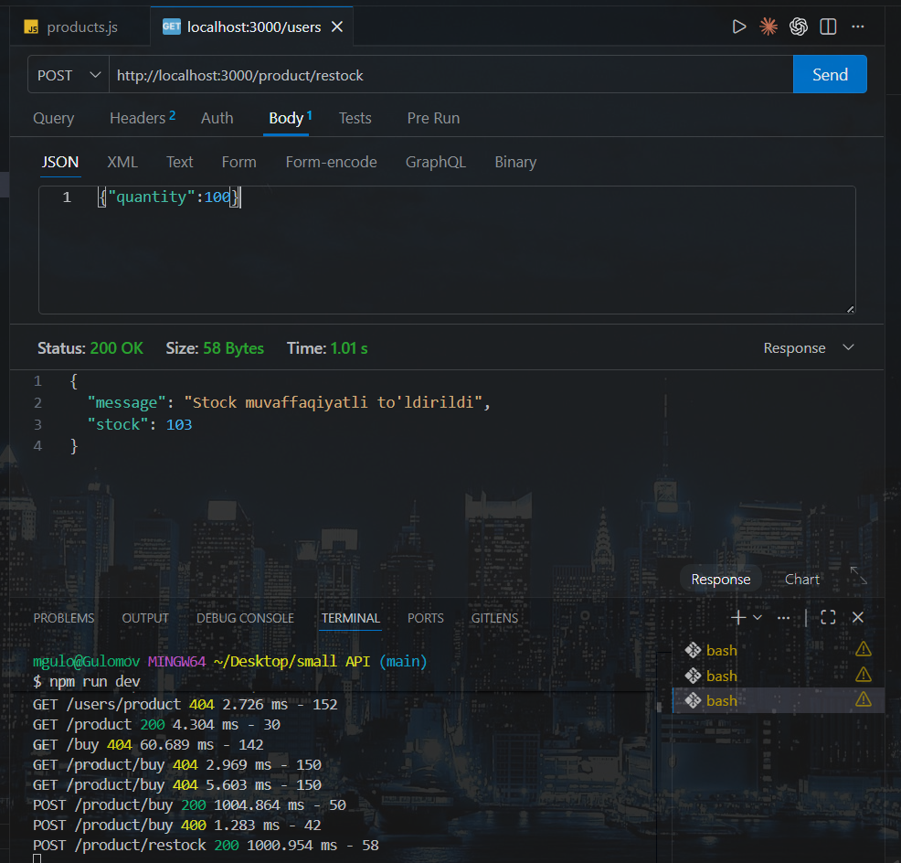

# Async-safe Product Stock API

A small Node.js + Express API that demonstrates how to handle **async race conditions** in a backend. The project simulates a product stock system where multiple users can buy or restock the same product, and shows how to protect shared data using a simple in-memory lock.

## Endpoints

| Method | URL | Description |
|--------|-----|-------------|
| `GET` | `/health` | Returns server status |
| `GET` | `/product` | Returns the current product and stock |
| `POST` | `/product/buy` | Buys a given quantity (async-safe) |
| `POST` | `/product/restock` | Adds stock to the product |

## Examples

### GET /product
Returns the current product object with its stock.



### POST /product/buy
Buys a given `quantity`. Reduces the stock if enough is available.



### POST /product/buy — not enough stock
If the requested quantity is greater than the current stock, the server returns a `400` error.



### POST /product/restock
Adds `quantity` to the current stock.



## The race condition problem

The `/buy` endpoint reads `product.stock`, awaits a simulated database delay, and then updates the stock. Without protection, two parallel requests can both pass the "is there enough stock?" check before either of them updates the value, leading to a **negative stock**.

### Reproducing the bug

A test script (`test.js`) sends two `/buy` requests in parallel:

```js
const requests = [];

for (let i = 0; i < 2; i++) {
  requests.push(
    fetch("http://localhost:3000/product/buy", {
      method: "POST",
      headers: { "Content-Type": "application/json" },
      body: JSON.stringify({ quantity: 4 }),
    })
  );
}

Promise.all(requests).then(async (responses) => {
  for (const response of responses) {
    console.log(await response.json());
  }
});
```

With stock = 5 and two requests of `quantity: 4`, the **unsafe** version returns:

```json
{ "message": "Purchase successful", "stock": 1 }
{ "message": "Purchase successful", "stock": -3 }
```

Both requests succeeded and the stock became **negative**. This is a classic async race condition.

## The fix — in-memory lock

The `/buy` endpoint uses a boolean flag (`isBuyInProgress`) to ensure only one purchase runs at a time. A second request that arrives while the first one is still running is rejected with `429 Too Many Requests`. The flag is released inside a `finally` block so the lock is always cleared, even if an error occurs.

With the lock in place, the same test now returns:

```json
{ "message": "Purchase successful", "stock": 5 }
{ "message": "Another purchase is in progress. Please try again." }
```

Only one request succeeds. The stock never goes negative.

## Running locally

```bash
npm install
node index.js
```

Server runs on port `3000`.

To reproduce the race condition test:

```bash
node test.js
```

## Notes

The in-memory lock used here is for **learning purposes only**. In production, where the backend runs across multiple processes or servers, each instance has its own memory and its own flag. Real systems use database transactions, row-level locks, atomic updates, or distributed locks (e.g. Redis) to achieve the same guarantee across machines.
